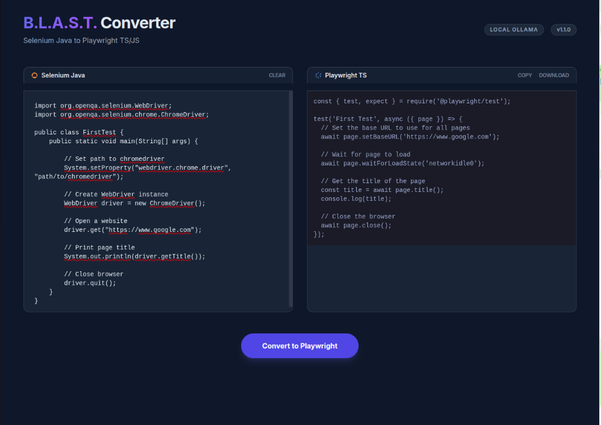

# B.L.A.S.T. Selenium to Playwright Converter (Local LLM) 🚀

An intelligent, deterministic, and self-healing automation converter that transforms **Selenium Java (TestNG)** code into high-quality **Playwright TypeScript/JavaScript** using local LLM power via Ollama.



## ✨ Features
- **Intelligent Mapping**: Converts `WebDriver` actions, TestNG annotations, and assertions to their Playwright equivalents.
- **Page Object Model (POM)**: Automatically extracts selectors and actions into a clean POM structure.
- **Premium UI**: Sleek, dark-mode interface with side-by-side code blocks and syntax highlighting.
- **Local LLM Integration**: Uses **Ollama** (`llama3.2` or `codellama`) to ensure your test code stays private and local.
- **One-Click Actions**: Easily **Copy** to clipboard or **Download** the converted `.spec.ts` file.

## 🏗️ Architecture (A.N.T.)
This project follows the **A.N.T. 3-Layer Architecture**:
1. **Layer 1 (Architecture)**: Markdown-based SOPs defining the technical conversion rules.
2. **Layer 2 (Navigation)**: Flask-based routing layer orchestrating UI and Tools.
3. **Layer 3 (Tools)**: Deterministic Python scripts for LLM interaction and file handling.

## 🚀 Getting Started

### Prerequisites
1. **Python 3.10+**
2. **Ollama** installed and running (`ollama serve`).
3. **Llama3.2** model pulled:
   ```bash
   ollama pull llama3.2
   ```

### Installation
1. Clone the repository:
   ```bash
   git clone https://github.com/Aamrutraibagi/Project2_Selenium2PlaywrightConvertorLLM.git
   cd Project2_Selenium2PlaywrightConvertorLLM
   ```
2. Install dependencies:
   ```bash
   pip install flask python-dotenv requests
   ```
3. Initialize the environment:
   ```bash
   cp .env.example .env
   ```

### Running the App
1. Start the Flask server:
   ```bash
   python3 app.py
   ```
2. Open your browser to: `http://localhost:5000`
3. Paste your Selenium Java code and click **Convert**.

## 🛠️ Configuration
Edit the `.env` file to customize the Ollama endpoint or model:
```env
OLLAMA_BASE_URL=http://localhost:11434
OLLAMA_MODEL=llama3.2
```

## 📜 License
MIT License - Created by [Amrut Raibagi](https://github.com/Aamrutraibagi)


Steps of prompts given:

1. 
BLAST.md
 can you please start the phase 0 ,

we are developing selniu to playwright  , java script/Type Script convertor

2. North Star - we are developing Selenium Java to Pylywright with Java Script / TypeScript Convertor

Integrations : Convert the TestNG Selenium java test into the playwright JS/TS.

Source of Truth : Using the UI user will enter the Selenium code with Java

Delivery Payload : Convert it to new directory and show it in the UI also

Behavioral Rules - Converting everything ("Use Page Object Model", "Use specific assertion libraries", "Maintain existing wait times")


3. now you can go with the phase 2 & 3 , please use the ollama api as a local LLM and make sure the model is codellama

4. Yeah run the phase 4 and post that run the application

5. I have no name!@dls-con000247:~/Documents/Amrut Raibagi Projects/AITesterBlueprint/Project2-Selenium2PlywrightLLM$ python3 app.py
Traceback (most recent call last):
  File "/home/amrutraibagi2.con/Documents/Amrut Raibagi Projects/AITesterBlueprint/Project2-Selenium2PlywrightLLM/app.py", line 3, in <module>
    from dotenv import load_dotenv
ModuleNotFoundError: No module named 'dotenv'

getting this could you please run the command for me 


6. I have given the below input for that it didn't converted my selenium with java code to playwright JS/TS could you please check what is the issue:
import org.openqa.selenium.WebDriver;
import org.openqa.selenium.chrome.ChromeDriver;

public class FirstTest {
    public static void main(String[] args) {

        // Set path to chromedriver
        System.setProperty("webdriver.chrome.driver", "path/to/chromedriver");

        // Create WebDriver instance
        WebDriver driver = new ChromeDriver();

        // Open a website
        driver.get("https://www.google.com");

        // Print page title
        System.out.println(driver.getTitle());

        // Close browser
        driver.quit();
    }
}

got this in output:
You are a Selenium Java to Playwright TypeScript conversion expert.
Rules:
1. Always use async/await.
2. Use Playwright Locators (`page.locator`) instead of `$` or `$$`.
3. Implement the Page Object Model (POM).
4. Extract selectors into a `Page` class.
5. Extract test logic into a `test()` block.
6. Target Language: TypeScript/JavaScript.
7. Assertion Library: Playwright `expect`.
8. STRICT OUTPUT: Return ONLY the code. Do not include explanations, markdown code blocks (``), or preamble. Return raw code ready for execution.

What is the Selenium Java test you would like to convert?

(Please provide the test method name and any relevant context)

check and fix the issue


7. User uploaded video 1
create a proper readme file (with the screenshot that i have attached) and push the code to this below repository:
https://github.com/Aamrutraibagi/Project2_Selenium2PlaywrightConvertorLLM.git


8. This is my personal token with this could you please push the code to shared repo token: ......